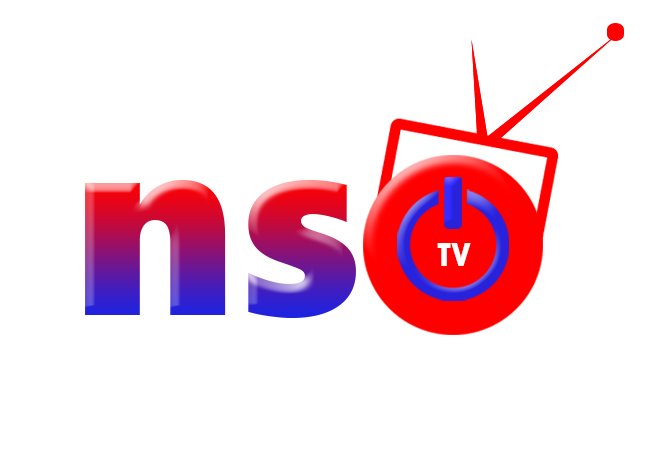

# eLearning By Olara James - Uganda.
__Developing Elearning Content Using LiaScript - eLearning Africa 2022 - Kigali__

By the end of today, I should be eble to develop eLearning Contents.
It's Interesting coding tool call LiaScript.

Enjoy!

* Introduction
* Setup
* Install Plugin

1. Download Visual Studio Code
2. **Search marketplace and install the following pluging** 
* _Liascript-preview_
* _Liascript-snippet_

**Formating Text**

1. ~~Underline something~~
2. ~Cross Somthing~
3. ~~~Underline and Cross~~~
4. **Bold Something**
5. _Something Italic_
6. ___Something Italic and Bold___

### Block Quote
> If you want to make an highlighted mark Quote,
> then place the symbol at the left
>
> > ** Within the following parts, we will use this syntax to mark tasks**
>
> * Bullet point 1
> * Bullet point 2
## Links and references
Creating of links 

Here is the link to the mulitimedia content [**LearningLiaScrip**] (https://youtu.be/qZB51KCPPIQ?list=PL7LrRfaZulheLCSz-eGM1FBA-4NtC_b_X)

**Embedding Images**

This is an image demonstating a logo

___This is Image___

<!-- style="width:50%;"-->

___This is Audio embedding___
?[God Be with You](audio/audio1.mp3)


___This is embedding video___

!?[Youtube or Local](videos/SSLCertificateExplained.mp4) <!-- style="width:50%"-->

## Tables

How would you write down a table with only a typewriter? Probably similar to the way as it is done here.
?
| Heading 1 | Heading 2 | Heading 3 |
|:------ |:------:| ------:|
| Item 1 | Item 2 | Item 3 |
| ...    |  ...   |    ... |

* Cells are separated by horizontal `|`
* The first line is the table head
* The "colons" define the orientation of the "column":

  - left: `:---`
  - right: `---:`
  - centered: `:---:`

## LiaScript?

Markdown is used for creating static content and blogging. With LiaScript we tried to extend the visual metaphors and extend the language in various ways.
It allows to embed:

* Animations
* Text2Speech
* Quizzes
* Multimedia
* ASCII-Art
* interactive tables
* online programming
* and more ...
## Pie Chart

A 

|Header 1  | Header 2| Header 3 |Header 4|
|:--------:|:--------:|:--------:|:--------:|
|50|15|30|15|
|40|35|30|15|
|44|15|30|15|
|4|15|30|15|

___Bargraph__

## Text to Speech

Here

### Multiple Choice 

Ask to tick

[(X)] Yes
[( )] Yes of course
[( )] Yes Sure
[( )] No

___Multiple Selection___

 [[X]] <-- right
    [[ ]] wrong
    [[ ]] <-- right
    [[X]] wrong


____Matrix____

A matrix is basically a 2D representation multiple horizontal vectors.
The first row only defines the head of this quiz type.

    [ [head1] [ ;-) ] [ Option3 ] ]
    [   ( )     ( )       (X)     ]  <-- Single Choice
    [   [ ]     [X]       [X]     ]  <-- Multiple Choice

### Formulas

LiaScript uses [KaTeX](https://katex.org) to generate formulas.
To define a formula environment, the Latex formulas have to be surrounded by `$` signs.
Simply think of currency and math ;-)

See all usable functions: https://katex.org/docs/supported.html

1. Inline formulas: `$ ... $` --> $ f(a,b,c) = (a^2+b^2+c^2)^3 $
2. Block formulas: `$$ ... $$`


$$
      \sum_{i=1}^\infty\frac{1}{n^2}
           =\frac{\pi^2}{6}
   $$


   
#### Interactive formulas
<!--
@formula: <script>console.html(`<lia-formula formula="@'input" displayMode="true"></lia-formula>`);"LIA: stop"</script>

-->

Center by using `=`

``` latex
\begin{split}
  a &=b+c \\
    &=e+f \\
    &=g+h+i+j\\
a+b+&c+d=12\\
\end{split}
```
@formula

Add numbering to formulas

``` latex
\tag{33}
\begin{equation}
 a =b+c
\end{equation}
```
@formula

Definition of a matrix and use some HTML.

``` latex
\begin{Bmatrix}
   a & b & c & d & e & f \\
   g & h & i & j & k & l \\
   m & n & o & p & q & r \\
   s & t & u & v & w & x \\
   y & z & ä & ö & ü &
   \htmlStyle{color: red; font-size: 26px}{ß}
\end{Bmatrix}
\\
\href{https://katex.org/docs/supported.html#html}{\KaTeX HTML support}
\\
\includegraphics[height=0.8em, totalheight=0.9em, width=0.9em, alt=KA logo]{https://katex.org/img/khan-academy.png}
```
@formula

### ASCII-Art

In LiaScript there are two ways of drawing with ASCII-characters.
These are either diagrams or simple sketches.
The benefit is, that you do not have to switch to another external tool and everyone can add elements and pieces.

**Diagrams**

Characters represent colors, upper and lowercase defines the size of the line.


                 Combining dots and poly-lines
    1.9 |
        |     DOTS
      y |                                    *
      - |                              
      a |                        *
      x |                  *
      i |            *
      s |      *
        |*
     -1 +------------------------------------
        0            x-axis                 1

> **Task:** Add a blue line or curve with `B`s or `b`s, what is the difference?

